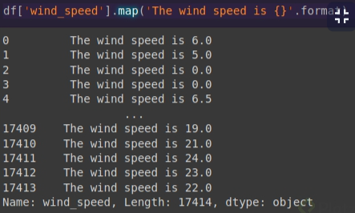

# Manipulacion-y-Analisis-de-Datos-con-Pandas-y-Python

[Dataset Search](https://datasetsearch.research.google.com/)
[kaggle.com](https://www.kaggle.com/)
[World Bank Open Data](https://data.worldbank.org/)

## 10 minutes to pandas

[url](https://pandas.pydata.org/pandas-docs/stable/user_guide/10min.html): https://pandas.pydata.org/pandas-docs/stable/user_guide/10min.html

## De paneles de datos al DataFrame

La función `query` es mucho mejor que los el otro tipo de filtros porque aumenta la legibilidad del código. Ejemplo:

```python
df.query( 'edad >= 12 and pais == "mx" ')
```

y

```python
df[(df['edad'] >= 12) & (df['pais'] == 'mx')]
```

Muestran los mismos resultados pero el primero es mucho más legible que el segundo.

Algunas funciones muy útiles cuando arrancas a analizar un set de datos luego de tenerlo como un dataframe(df) son:

- `df.info()` te devuelve un resumen con la estructura de las variables y el tipo de datos que contienen.
- `df.describe()` te devuelve un summary() de tu set de datos. Si tienes variables numericas te devolvera: minimo. maximo, media,std,…etc de las columnas numericas.

## Cómo usar Pandas y Python para conectar con tu base de datos SQL

Pandas cuenta con una funcionalidad que facilita el acceso a tus bases de datos tipo SQL, para ello te mostrare algunos ejemplos:

### PostgreSQL

Valida que tengas la librería psycopg2 usando el comando import. Si no está instalada en tu ambiente, usa el comando !pip install psycopg2 en la terminal de python para instalarlo.

Comenzamos cargando las librerías:

```python
import pandas as pd
import psycopg2
```

Luego creamos el elemento de conexión con el siguieente código:

```python
conn_sql = psycopg2.connect(user = "user_name",
                            password = "password",
                            host = "xxx.xxx.xxx.xxx",
                            port = "5432",
                            database = "postgres_db_name")
```

Seguido simplemente definimos nuestra query en SQL:

```python
query_sql = '''
select *
from table_name
limit 10
'''
```

Y creamos nuestro dataframe:

```python
df = pd.read_sql(query_sql, sql_conn)
df.head(5)
```

### SQL Server:

Valida que tengas la librería pyodbc usando el comando import, si no está instalada en tu ambiente, usa el comando !pip install pyodbc en la terminal python para instalarlo.

Comenzamos cargando las librerías:

```python
import pandas as pd
import pyodbc
```

Luego creamos el elemento de conexión con el siguiente código:

```python
driver = '{SQL Server}'
server_name = 'server_name'
db_name = 'database_name'
user = 'user'
password = 'password'
sql_conn = pyodbc.connect('''
DRIVER={};SERVER={};DATABASE={};UID={};PWD={};
Trusted_Connection=yes
'''.format(driver, server_name, db_name, user, password))
```

O si tienes el DSN:

```python
dsn = 'odbc_datasource_name'
sql_conn = pyodbc.connect('''
DSN={};UID={};PWD={};Trusted_Connection=yes;
'''.format(dsn, user, password))
Seguido simplemente definimos nuestra query en SQL:
query_sql = 'select * from table_name limit 10'
```

Y creamos nuestro dataframe con:

```python
df = pd.read_sql(query_sql, sql_conn)
df.head(5)
```

### MySQL / Oracle / Otras:

Valida que tengas la librería sqlalchemy usando el comando import, si no está instalada en tu ambiente, usa el comando !pip install sqlalchemy en la terminal de python para instalarlo.

Comenzamos cargando las librerías:

```python
import pandas as pd
import sqlalchemy as sql
Escogemos nuestra base de datos, Oracle, MySql o la de tu preferencia:
database_type = 'mysql'
database_type = 'oracle'
```

Luego creamos el elemento de conexión con el siguiente código:

```python
user = 'user_name'
password = 'password'
host = 'xxx.xxx.xxx.xxx:port'
database = 'database_name'

conn_string = '{}://{}:{}@{}/{}'.format(
database_type, user, password, host, database)

sql_conn = sql.create_engine(conn_string)
```

Seguido simplemente definimos nuestra query en SQL:

```python
query_sql = "
select *
from table_name
limit 10
"
```

Y creamos nuestro dataframe con:

```python
df = pd.read_sql(query_sql, sql_conn)
df.head(5)
```

La libreria `sqlalchemy` también soporta PostgreSQL y otras fuentes de datos.

## Ventajas y desventajas de los formatos de importar y guardado

- **CSV** - Es muy versatil ya que solo tiene comas y saltos de linea
- **JSON** - Tiene un formato muy similar al de un diccionario de Python
- **Excel** - Permite guardar el archivo en formato .xls para trabajar con el en Excel o Spreadsheets
- **Pickle** - Permite comprimir la información, es util cuando se tienen tablas grandes
- **Parquet** - Permite darle un formato que puede usarse en ambientes de Big Data como Hadoop

## Formatos de lectura para cargar y guardar DataFrames

- **CSV y formatos String** : Son simples, requieren alto costo computacional y algo lentos.

- **HDF** : Gran soporte, adecuado para grandes cantidades de datos, rápido a costo de alto costo computacional.

- **Parquet** : Puede igualar a hdf e inclusive trabajar por chunks y en paralelo.

- **Pickle** : Es práctico pero lento con grandes cantidades de datos.

## Fixing a data type

- **object** -> Python strings (or other Python objects)
- **bool** -> enables logical and mathematical operations
- **int** -> mathematical operations can be performed
- **float** -> mathematical operations can be performed
- **category** -> results in less memory usage and faster processing
- **datetime** -> enables a rich set of date-based attributes and methods

## Funciones más complejas y lambdas

Además de apply, también se pueden usar las funciones applymap y map, dependiendo de la necesidad.

- `apply()` se utiliza para aplicar una función a lo largo de un eje (columna o fila).
- `applymap()` se usa para aplicar una función a todos los elementos del DataFrame
- `map()` se usa para sustituir cada valor de una fila por otro valor.
  Un ejemplo del uso de map() sería:



## Cómo trabajar con variables tipo texto en Pandas

Pandas cuenta con una gran funcionalidad a la hora de interactuar con texto, es super versatil si estas interesado en crear modelos de análisis de lenguaje natural.

Comencemos cargando nuestra librería y creando un diccionario con nombres de personas.

```python
import pandas as pd
data = {'names':['Sara Moreno 34',
                 'jUAn GOMez 23',
                 'CArlos mArtinez 89',
                 'Alfredo VelaZques 3',
                 'luis Mora 56',
                 '#moonmakers 10',pd.NA]}
```

Usemos los datos del diccionario para crear nuestro DataFrame. Nuestro DataFrame contiene una columna tipo texto, con variedades de caracteres especiales, números, mayúsculas e inclusive variables nulas.

```
df = pd.DataFrame(data)
df
```

|     | names               |
| --- | ------------------- |
| 0   | Sara Moreno 34      |
| 1   | jUAn GOMez 23       |
| 2   | CArlos mArtinez 89  |
| 3   | Alfredo VelaZques 3 |
| 4   | luis Mora 56        |
| 5   | #moonmakers 10      |

Para usar las funciones asociadas a texto usamos str en nuestro DataFrame, por ejemplo, si se quiere colocar el texto en minúscula, basta con escribir:

```python
df['names'].str.lower()
```

|     | names               |
| --- | ------------------- |
| 0   | sara moreno 34      |
| 1   | juan gomez 23       |
| 2   | carlos martinez 89  |
| 3   | alfredo velazques 3 |
| 4   | luis mora 56        |
| 5   | #moonmakers 10      |

Para mayúsculas igualmente:

```python
df['names'].str.upper()
```

```
names
0 SARA MORENO 34
1 JUAN GOMEZ 23
2 CARLOS MARTINEZ 89
3 ALFREDO VELAZQUES 3
4 LUIS MORA 56
5 #MOONMAKERS 10
6
```

O si queremos solo la primera letra en mayúscula:

```python
df['names'].str.capitalize()
```

```
	names
0	Sara moreno 34
1	Juan gomez 23
2	Carlos martinez 89
3	Alfredo velazques 3
4	Luis mora 56
5	#moonmakers 10
6
```

Para contar la longitud de nuestro texto usamos:

```python
df['names'].str.len()
```

```
0 14
1 13
2 18
3 19
4 12
5 20
6
```

Para dividir el texto por espacios usamos split y definimos el carácter por
el que queremos dividir, en este caso, un espacio vacío ' ' o '#':

```python
df['names'].str.split(' ')
```

```
names
0	[‘Sara’, ‘Moreno’, ‘34’]
1	[‘jUAn’, ‘GOMez’, ‘23’]
2	[‘CArlos’, ‘mArtinez’, ‘89’]
3	[‘Alfredo’, ‘VelaZques’, ‘3’]
4	[‘luis’, ‘Mora’, ‘56’]
5	[‘#moonmakers’, ‘10’]
6
```

```python
df['names'].str.split('#')
```

```
names
0	[‘Sara Moreno 34’]
1	[‘jUAn GOMez 23’]
2	[‘CArlos mArtinez 89’]
3	[‘Alfredo VelaZques 3’]
4	[‘luis Mora 56’]
5	[‘moonmakers 10’]
6
```

Para seleccionar los primeros o últimos 5 caracteres usamos:

```python
df['names'].str[:5]
```

```
names
0	Sara
1	jUAn
2	CArlo
3	Alfre
4	luis
5	#moon
6
```

```python
df['names'].str[-5:]
```

```
names
0	no 34
1	ez 23
2	ez 89
3	ues 3
4	ra 56
5	rs 10
6
```

Podemos reemplazar una secuencia de caracteres por otra mediante:

```python
df['names'].str.replace('Alfredo','Antonio')
```

```
names
0 Sara Moreno 34
1 jUAn GOMez 23
2 CArlos mArtinez 89
3 Antonio VelaZques 3
4 luis Mora 56
5 #moonmakers 10
6
```

También podemos buscar una secuencia de texto en específico, en este caso,
'ara':

```python
df['names'].str.findall('ara')
```

```
	names
0	[‘ara’]
1	[]
2	[]
3	[]
4	[]
5	[]
6
```

También podemos crear un filtro basándonos en una secuencia de texto en
específico, en este caso, las filas que tengan 'or':

```python
df['names'].str.contains('or')
```

```
names
0	True
1	False
2	False
3	False
4	True
5	False
6
```

Así mismo, podemos contar el número de ocurrencias de un caracter en específico,
por ejemplo, cuántas veces aparece la letra 'a':

```python
df['names'].str.lower().str.count('a')
```

```
names
0	2
1	0
2	0
3	1
4	1
5	1
6
```

Existen comandos más avanzados usando Regex, por ejemplo, si quiero extraer los
caracteres numéricos:

```python
df['names'].str.extract('([0-9]+)', expand=False)
```

```
names
0	34
1	23
2	89
3	3
4	56
5	10
6	nan
```

O, por ejemplo, si quiero extraer las menciones '@xxxx' del texto:

```python
df['names'].str.replace('@[^\s]+','')
```

```
names
0	Sara Moreno 34
1	jUAn GOMez 23
2	CArlos mArtinez 89
3	Alfredo VelaZques 3
4	luis Mora 56
5	#moonmakers 10
6
```

## ¿Cómo lidiar con datos faltantes en tus DataFrames?

Es muy común que nuestros DataFrames presenten datos faltantes, antes de empezar a procesar nuestros DataFrames veamos un poco en qué consisten los objetos **NaN** (Not a Number).

Importemos las librerias Pandas y Numpy para esto:

```python
import numpy as np
import pandas as pd
```

Un número que no está definido usualmente se representa con el siguiente objeto:

```python
np.nan
> nan
```

¡Este objeto tiene propiedades matemáticas! Al sumar un número, obtenemos como
respuesta el mismo **NaN**.

```python
np.nan + 0
> nan
```

```python
np.nan > 0
> False
```

La versión 1.0 de pandas incluye un nuevo objeto **NA**, que es mucho más
general pues, ademas de interactuar con números, tambien puede hacerlo con
cadenas de texto u otras varaibles como las de tipo booleano. Si quieres que
esta nueva definición este incluida entre tus cálculos usa:

```python
 pd.options.mode.use_inf_as_na = True
```

Al sumar **NA** a una cadena de texto, obtengo el mismo **NA**:

```python
pd.NA +'Hola mundo'
> <NA>
```

```python
pd.NA | False
> <NA>
```

A continuación, vamos a crear un DataFrame

```python
df = pd.DataFrame(np.arange(0, 15).reshape(5, 3), columns=['a', 'b', 'c'])
df
```

|     | a   | b   | c   |
| --- | --- | --- | --- |
| 0   | 0   | 1   | 2   |
| 1   | 3   | 4   | 5   |
| 2   | 6   | 7   | 8   |
| 3   | 9   | 10  | 11  |
| 4   | 12  | 13  | 14  |

Y vamos a añadir algunas variables no definidas:

```python
df['d'] = np.nan
df['e'] = np.arange(15, 20)
df.loc[5,:] = pd.NA
df.loc[4,'a'] = pd.NA
df.loc[0,'d'] = 1
df.loc[5,'d'] = 10
df
```

```
a	b	c	d	e
0	0.0	1.0	2.0	1	15.0
1	3.0	4.0	5.0	nan	16.0
2	6.0	7.0	8.0	nan	17.0
3	9.0	10.0	11.0	nan	18.0
4	<NA>	13.0	14.0	nan	19.0
5	<NA>	<NA>	<NA>	10	<NA>
```

Para reconocer cuando un objeto es nulo simplmente usamos:

```python
df.isnull()
```

```
a	b	c	d	e
0	0	0	0	0	0
1	0	0	0	1	0
2	0	0	0	1	0
3	0	0	0	1	0
4	1	0	0	1	0
5	1	1	1	0	1
```

En dónde todas nuestras variables no definidas fueron marcadas con **TRUE**,
**df.isna()** tambien cumple esta función.

Conocer el número de variables nulas por columna puede hacerse juntando el
comando anterior con la funcion de suma:

```python
df.isnull().sum()
```

```

a	2
b	1
c	1
d	4
e	1
dtype: int64
```

Si lo que nos interesa es conocer el número de filas con elementos nulos, basta
con usar **axis=1:**

```python
df.notnull().sum(axis=1)
```

```

0	5
1	4
2	4
3	4
4	3
5	1
dtype: int64
```

O todos los elementos nulos de nuestro DataFrame:

```python
df.size-df.isnull().sum().sum()
```

21

Reconocer estos elementos nos puede ayudar a filtrar en nuestro DataFrame, en
este caso, me gustaría filtrar por las variables no nulas de la columna **‘a’**:

```python
df[df['a'].notnull()]
```

```
a	b	c	d	e
0	0	1	2	1	15
1	3	4	5	nan	16
2	6	7	8	nan	17
3	9	10	11	nan	18
```

dropna es perfecto para elimnar rapidamente las filas con registros faltantes:

```python
df.dropna()
```

```
a	b	c	d	e
0	0	1	2	1	15
```

```python
df[['a']].dropna()
```

```
	a
0	0
1	3
2	6
3	9
```

Ya que hemos visto cómo funcionan las variable nulas, veamos cómo lidiar con
ellas. Usando la función fillna podremos reemplazarlas por el valor que
querramos, en este caso 0.

```python
df.fillna(0)
```

```
	a	b	c	d	e
0	0	1	2	1	15
1	3	4	5	0	16
2	6	7	8	0	17
3	9	10	11	0	18
4	0	13	14	0	19
5	0	0	0	10	0
```

Si quisieramos remplazar con el valor siguiente usamos
`method="ffill"`:

```python
df.fillna(method="ffill")
```

```
a	b	c	d	e
0	0	1	2	1	15
1	3	4	5	1	16
2	6	7	8	1	17
3	9	10	11	1	18
4	9	13	14	1	19
5	9	13	14	10	19
```

Si quisieramos remplazar con el valor previo usamos
`method="bfill"`:

```python
df.fillna(method="bfill")
```

```
	a	b	c	d	e
0	0.0	1.0	2.0	1	15.0
1	3.0	4.0	5.0	10	16.0
2	6.0	7.0	8.0	10	17.0
3	9.0	10.0	11.0	10	18.0
4	<NA>	13.0	14.0	10	19.0
5	<NA>	<NA>	<NA>	10	<NA>
```

El mismo ejercicio anterior se puede aplicar con las filas usando `axis=1`:

```python
df.fillna(method="bfill",axis=1)
```

```
a	b	c	d	e
0	0	1	2	1	15.0
1	3	4	5	16	16.0
2	6	7	8	17	17.0
3	9	10	11	18	18.0
4	13	13	14	19	19.0
5	10	10	10	10	<NA>
```

Podemos usar también una serie para reemplazar los valores de una columna en especifico, es importante que haya emparejamiento entre los índices:

```python
fill = pd.Series([100, 101, 102])
fill
```

```

0	100
1	101
2	102
dtype: int64
```

```python
df['d'] = df['d'].fillna(fill)
df['d']
```

```

0	1
1	101
2	102
3	nan
4	nan
5	10
Name: d, dtype: float64
```

```
df
```

```
a	b	c	d	e
0	0.0	1.0	2.0	1	15.0
1	3.0	4.0	5.0	101	16.0
2	6.0	7.0	8.0	102	17.0
3	9.0	10.0	11.0	nan	18.0
4	<NA>	13.0	14.0	nan	19.0
5	<NA>	<NA>	<NA>	10	<NA>
```

Una de las formas más usadas para reemplazar datos es usar el promedio de las columnas, esto se hace con la función mean. O si se quiere un mejor estimador, usamos median.

```python
df.fillna(df.median())
```

```
a	b	c	d	e
0	0	1	2	1	15
1	3	4	5	101	16
2	6	7	8	102	17
3	9	10	11	55.5	18
4	4.5	13	14	55.5	19
5	4.5	7	8	10	17
```

Por último, Pandas también puede interporlar los valores faltanes calculando el valor que puede haber existido en el medio.

```python
df_d = pd.concat([df[['d']], df[['d']].interpolate()],axis=1)
df_d.columns = ['d_antes','d_interpolado']
df_d
```

```

d_antes	d_interpolado
0	1	1
1	101	101
2	102	102
3	nan	71.3333
4	nan	40.6667
5	10	10
```

## Cómo lidiar con datos duplicados en Pandas

Es muy usual que los registros de una base de datos aparezcan más de una vez, así que veamos cómo pandas puede ayudarnos a lidiar con estos casos. Para comenzar, importemos pandas y creemos un DataFrame con dos columnas y algunos datos repetidos.

```python
import pandas as pd
```

```python
df = pd.DataFrame({'a': ['w'] * 4 + ['x'] * 3 + ['y'] * 2 + ['z']+['v'],
                   'b': [1, 1, 1, 1, 2, 2, 2, 3, 3, 4,5]})
df
```

```
	a	b
0	w	1
1	w	1
2	w	1
3	w	1
4	x	2
5	x	2
6	x	2
7	y	3
8	y	3
9	z	4
10	v	5
```

Para encontrar los registros duplicados usamos duplicated , que marca con True aquellos casos de filas duplicadas:

```python
df.duplicated()
```

```

0	False
1	True
2	True
3	True
4	False
5	True
6	True
7	False
8	True
9	False
10	False
```

Podemos usar `keep='first'` para marcar solo la primera ocurrencia o `keep='last'` para marcar la última:

```python
df.duplicated(keep='first')
```

```
0	False
1	True
2	True
3	True
4	False
5	True
6	True
7	False
8	True
9	False
10	False
```

```python
df.duplicated(keep='last')
```

```
0	True
1	True
2	True
3	False
4	True
5	True
6	False
7	True
8	False
9	False
10	False
```

Identificados los casos duplicados, podemos usar este resultado para filtrar y seleccionar aquellos que no tienen un registro duplicado:

```python
df[~ df.duplicated()]
```

```
	a	b
0	w	1
4	x	2
7	y	3
9	z	4
10	v	5
```

Si quisieras dejar el primer registro de los duplicados o el último, recuerda usar `keep='first'` o `keep='last'`. Remarco el hecho de que usé negación '~' para ver los registros no duplicados.

Y si me interesara ver cuáles son los registros duplicados, podemos usar keep=False:

```python
df.duplicated(keep=False)
```

```
	0
0	True
1	True
2	True
3	True
4	True
5	True
6	True
7	True
8	True
9	False
10	False
```

```python
df[df.duplicated(keep=False)]
```

```
	a	b
0	w	1
1	w	1
2	w	1
3	w	1
4	x	2
5	x	2
6	x	2
7	y	3
8	y	3
```

Por último, puedes usar el comando 'drop_duplicates' para eliminar los duplicados. Por defecto, la función guarda el primer resultado `keep='first'`:

```python
df.drop_duplicates()
```

```

a	b
0	w	1
4	x	2
7	y	3
9	z	4
10	v	5
```

Y si quieres solo borrar duplicados teniendo en cuenta una sola columna, lo puedes hacer mediante una lista nombrando las columnas donde vas a eliminar los duplicados, en este caso, ['a']:

```python
df.drop_duplicates(['a'],keep='last')
```

```
	a	b
3	w	1
6	x	2
8	y	3
9	z	4
10	v	5
```

## Aggregation y groupby

Un tema que vale la pena tener en cuenta es que la función value_counts por defecto ignora los valores ausentes, para tomarlos en cuenta se puede añadir dropna=False

```python
df['day'].value_counts(dropna=False)
```

## Group By: extraer valor con variables categóricas

- **groupby**: para aplicar una función a un conjunto de datos. Se puede usar de varias formas

1. Forma simple

```python
df.groupby('column1').function
```

Donde function puede ser: mean(), median(), etc. En este sentido, Pandas tomará a ‘column1’ como índice y al resto del dataframe le aplicará la función definida.

1. Con funciones lambdas o auxiliares

Donde some_function pueden ser funciones lambdas u otras que hayamos definido. En esta operación, Pandas tomará a ‘column1’ como índice y las columnas serán el resultado de aplicar some_function sobre ‘column2’ y ‘column3’.

Nota: también pueden tomarse varias columnas como índices escribiendolas en una lista.

- aggregate (o agg): para aplicar más de una función. La sintaxis de esta función sigue la misma lógica que la de groupby, solo que se añade ‘agg’ (o ‘aggregate’) al final de la sentencia con una lista de funciones a aplicar. Ejemplos:

```python
df.groupby('column1').agg([np.mean,np.max])

df.groupby(['column1','column2'])[['column3','column4']].aggregate([np.mean,np.max])
```

De igual manera, Pandas realizará lo siguiente:

- tomará como índice las columnas que esten entre paréntesis.
- tomará como columnas el resultado de aplicar las funciones especificadas en ‘aggregate’ a la lista de columnas entre corchetes.

## Tablas dinámicas con Pivot Table

Queria ver como son las propinas de hombres vs mujeres cada dia.

```python
df_valores = df.pivot_table(values='total_bill', index=['sex', 'day', 'smoker'], columns=['time'], aggfunc=[np.mean, np.median, np.max])
df_valores
```

Luego llenar los valores nulos con 0.

```python
df_valores.fillna(0)
```

Algunas opciones de resample

| Alias  | Description           |
| ------ | --------------------- |
| B      | Business day          |
| D      | Calendar day          |
| W      | Weekly                |
| M      | Month end             |
| Q      | Quarter end           |
| A      | Year end              |
| BA     | Business year end     |
| AS     | Year start            |
| H      | Hourly frequency      |
| T, min | Minutely frequency    |
| S      | Secondly frequency    |
| L, ms  | Millisecond frequency |
| U, us  | Microsecond frequency |
| N, ns  | Nanosecond frequency  |
